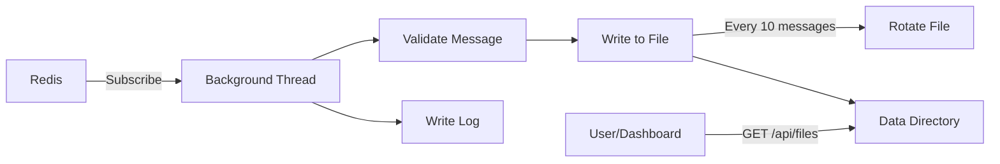
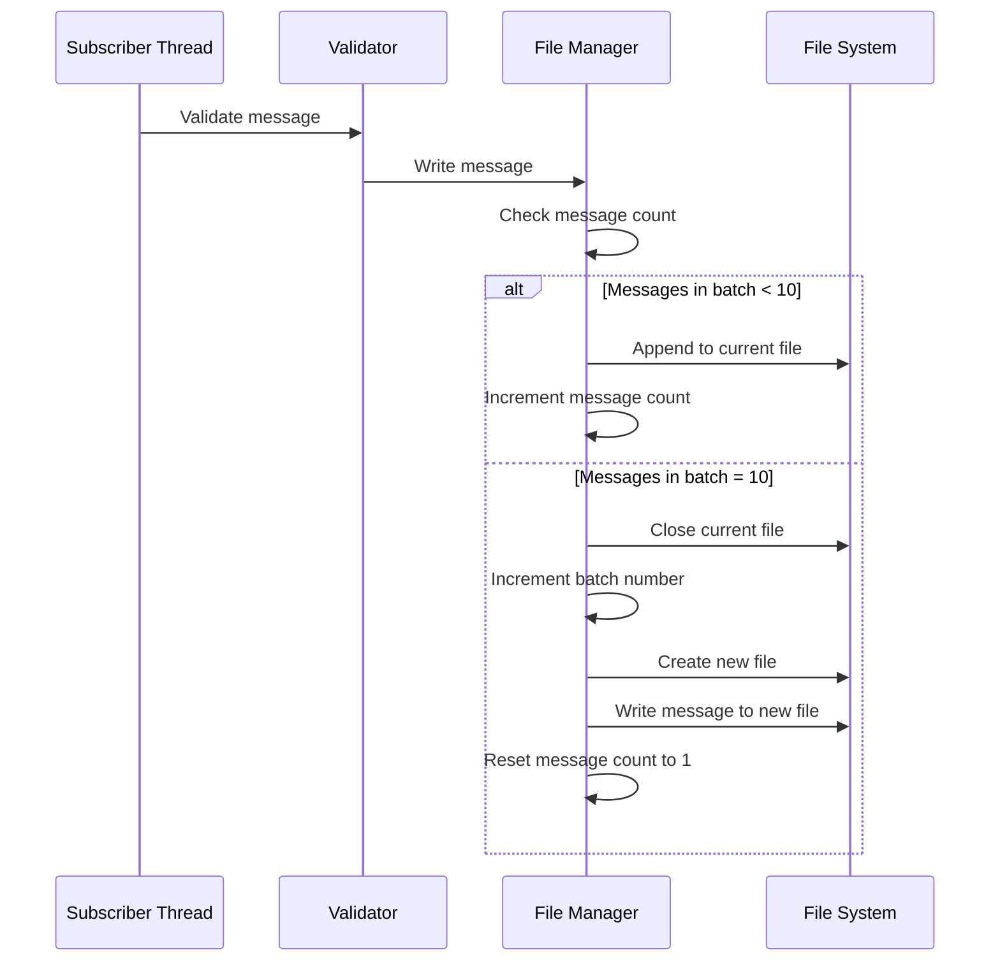

# Example Receiver Service - Shaping Document

## Problem Statement

We need a reference implementation of a **message consumer service** to validate HomeHelper's core functionality for service apps, particularly:
- Redis event subscription
- File-based data persistence
- File rotation logic
- REST API for file browsing
- Health monitoring
- Data directory management

**Current situation**: The HomeHelper specification is complete, but there's no concrete example to validate the system works as designed or to serve as a template for developers building subscriber services.

**Appetite**: 1.5 days

## Solution Approach

Create a simple message consumer service that:
- Subscribes to messages published by the Example Sender Service
- Writes received messages to text files in the data directory
- Rotates files every 10 messages
- Exposes REST API for file listing and content viewing
- Provides health status monitoring
- Writes operational logs

This service will serve as the "receiver" in a sender/receiver demo pair, demonstrating the subscriber side of Redis-based inter-app communication.

## Key Architectural Decisions

### Message Consumption Architecture



### Event Subscription Design

**Event Type**: `example.message.sent`

**Expected Payload Structure**:
```json
{
  "source": "example_sender",
  "event_type": "example.message.sent",
  "timestamp": 1704067200,
  "data": {
    "message_number": 42,
    "content": "this is Message N° 42 being posted into Redis at 2024-01-01 10:30",
    "sender_uptime_seconds": 1260
  }
}
```

### File Storage Strategy

**File Naming Convention**: `messages_batch_NNNN.txt`
- Example: `messages_batch_0001.txt`, `messages_batch_0002.txt`
- Zero-padded 4 digits (supports up to 9999 batches)
- Sequential numbering

**File Location**: `{data_dir}/example_receiver/messages/`

**File Content Format**:
```
[2024-01-01 10:30:00] Message #42: this is Message N° 42 being posted into Redis at 2024-01-01 10:30
[2024-01-01 10:30:30] Message #43: this is Message N° 43 being posted into Redis at 2024-01-01 10:31
...
```

**File Rotation Logic**:
- Each file contains exactly 10 messages
- After writing the 10th message, close current file
- Increment batch number and create new file
- No maximum number of files (unbounded growth)

## Breadboard - API Interactions

```
[Dashboard] --GET--> [/health] 
    --> {health: "good", message: "Receiver running", extra_info: {total_messages_received: 456, ...}}

[Dashboard] --GET--> [/ui] 
    --> ["files"]

[Dashboard] --GET--> [/api/files] 
    --> [{id:1, filename:"messages_batch_0001.txt", message_count:10, date_created:...}, ...]

[Dashboard] --GET--> [/api/files/1] 
    --> {id:1, filename:"...", message_count:10, file_size_bytes:1234, content:"...", ...}
```

## Technical Requirements & Components

### Core Modules

1. **FastAPI Application**: REST API server
2. **Redis Subscriber**: Background thread listening to events
3. **File Manager**: Handles file writing and rotation
4. **Message Validator**: Validates incoming message structure
5. **Logger**: File-based logging

### Dependencies (requirements.txt)

```
fastapi==0.104.1
uvicorn==0.24.0
redis==5.0.1
```

### State Management

- **Messages received counter**: Integer, total messages processed
- **Current batch number**: Integer, increments with each file rotation
- **Messages in current batch**: Integer, resets to 0 after rotation (max 10)
- **Current file handle**: File object for active batch file
- **File metadata cache**: List of file info for API responses
- **Last message received time**: For health reporting
- **Redis connection status**: For health reporting

## Implementation Details

### File Rotation Logic



**Pseudo-logic**:
```python
current_batch_number = 1
messages_in_current_batch = 0
current_file = None

def write_message(message_content):
    global current_batch_number, messages_in_current_batch, current_file
    
    # Open file if needed
    if current_file is None:
        filename = f"messages_batch_{current_batch_number:04d}.txt"
        filepath = data_dir / "messages" / filename
        current_file = open(filepath, 'a')
    
    # Format and write message
    timestamp = datetime.now().strftime('%Y-%m-%d %H:%M:%S')
    line = f"[{timestamp}] {message_content}\n"
    current_file.write(line)
    current_file.flush()  # Ensure immediate write
    
    messages_in_current_batch += 1
    
    # Check if rotation needed
    if messages_in_current_batch >= 10:
        current_file.close()
        current_file = None
        current_batch_number += 1
        messages_in_current_batch = 0
        logger.info(f"Rotated to batch {current_batch_number}")
```

### Message Validation

**Required Fields**:
- `source`: String
- `event_type`: String (must be "example.message.sent")
- `timestamp`: Integer
- `data`: Object containing:
  - `message_number`: Integer
  - `content`: String

**Validation Logic**:
```python
def validate_message(event):
    try:
        # Check top-level fields
        if not isinstance(event, dict):
            return False, "Event is not a dictionary"
        
        if event.get('event_type') != 'example.message.sent':
            return False, f"Unexpected event type: {event.get('event_type')}"
        
        if 'data' not in event:
            return False, "Missing 'data' field"
        
        data = event['data']
        
        # Check required data fields
        if 'message_number' not in data:
            return False, "Missing 'message_number' in data"
        
        if 'content' not in data:
            return False, "Missing 'content' in data"
        
        if not isinstance(data['message_number'], int):
            return False, "message_number must be integer"
        
        if not isinstance(data['content'], str):
            return False, "content must be string"
        
        return True, None
        
    except Exception as e:
        return False, f"Validation error: {str(e)}"
```

**Error Handling**:
- Invalid messages are logged but not written to files
- Service continues processing subsequent messages
- Validation errors don't crash the subscriber

### Redis Subscriber Implementation

**Implementation approach**:
- Use `threading.Thread` with `daemon=True`
- Subscribe to specific channel: `homehelper:events:example.message.sent`
- Blocking `listen()` loop
- Graceful shutdown via `threading.Event()`

```python
shutdown_event = threading.Event()

def message_subscriber():
    pubsub = redis_client.pubsub()
    pubsub.subscribe("homehelper:events:example.message.sent")
    logger.info("Started subscribing to example.message.sent events")
    
    for message in pubsub.listen():
        if shutdown_event.is_set():
            break
            
        if message['type'] == 'message':
            try:
                # Parse JSON
                event = json.loads(message['data'])
                
                # Validate
                is_valid, error = validate_message(event)
                if not is_valid:
                    logger.warning(f"Invalid message: {error}")
                    continue
                
                # Extract content
                message_number = event['data']['message_number']
                content = event['data']['content']
                
                # Write to file
                write_message(f"Message #{message_number}: {content}")
                
                logger.info(f"Received and saved message #{message_number}")
                
            except json.JSONDecodeError as e:
                logger.error(f"Failed to parse message JSON: {e}")
            except Exception as e:
                logger.error(f"Error processing message: {e}")
    
    pubsub.close()
    logger.info("Subscriber thread stopped")

# Start thread
subscriber_thread = threading.Thread(target=message_subscriber, daemon=True)
subscriber_thread.start()
```

**Error Handling**:
- JSON parsing errors: Log and continue
- Validation errors: Log and continue
- File write errors: Log and continue (critical - might need to alert)
- Redis connection errors: Log, subscriber will retry automatically

### File Metadata Scanning

For API endpoints, need to scan data directory and build file list:

```python
def scan_message_files():
    """Scan data directory and return list of file metadata"""
    messages_dir = data_dir / "example_receiver" / "messages"
    
    if not messages_dir.exists():
        return []
    
    files = []
    for filepath in sorted(messages_dir.glob("messages_batch_*.txt")):
        # Parse batch number from filename
        batch_num = int(filepath.stem.split('_')[-1])
        
        # Get file stats
        stat = filepath.stat()
        
        # Count lines in file
        with open(filepath, 'r') as f:
            message_count = sum(1 for _ in f)
        
        files.append({
            "id": batch_num,
            "filename": filepath.name,
            "message_count": message_count,
            "file_size_bytes": stat.st_size,
            "date_created": int(stat.st_ctime),
            "date_modified": int(stat.st_mtime)
        })
    
    return files
```

## REST API Specifications

### GET /health

**Response**:
```json
{
  "health": "good",
  "message": "Receiver service running normally",
  "extra_info": {
    "total_messages_received": 456,
    "current_batch_number": 46,
    "messages_in_current_batch": 6,
    "total_files": 45,
    "last_message_received": "2024-01-01 10:30:00",
    "redis_connected": true
  }
}
```

**Health Status Logic**:
- `"good"`: Redis connected, messages being received and written
- `"warning"`: Redis connection issues OR no messages received in 5+ minutes
- `"error"`: File write errors OR critical failure

### GET /ui

**Response**:
```json
["files"]
```

### GET /api/files

**Response**:
```json
[
  {
    "id": 1,
    "filename": "messages_batch_0001.txt",
    "message_count": 10,
    "file_size_bytes": 1234,
    "date_created": 1704067200,
    "date_modified": 1704067500
  },
  {
    "id": 2,
    "filename": "messages_batch_0002.txt",
    "message_count": 10,
    "file_size_bytes": 1256,
    "date_created": 1704067800,
    "date_modified": 1704068100
  },
  {
    "id": 3,
    "filename": "messages_batch_0003.txt",
    "message_count": 7,
    "file_size_bytes": 892,
    "date_created": 1704068400,
    "date_modified": 1704068610
  }
]
```

**Notes**:
- Returns files in chronological order (oldest first)
- Last file may have fewer than 10 messages (current batch)
- Returns empty array if no files exist yet

### GET /api/files/{id}

**Response**:
```json
{
  "id": 1,
  "filename": "messages_batch_0001.txt",
  "message_count": 10,
  "file_size_bytes": 1234,
  "date_created": 1704067200,
  "date_modified": 1704067500,
  "content": "[2024-01-01 10:30:00] Message #1: this is Message N° 1 being posted into Redis at 2024-01-01 10:30\n[2024-01-01 10:30:30] Message #2: ...\n...",
  "first_message_number": 1,
  "last_message_number": 10
}
```

**Error Response** (404 if not found):
```json
{
  "error": "Not Found",
  "message": "File with id 1 not found. It may not exist yet."
}
```

**Notes**:
- `content` field contains full file contents as string
- `first_message_number` and `last_message_number` parsed from content
- File content is read fresh on each request (no caching)

## Manifest File

### homehelper.json

```json
{
  "name": "Example Receiver Service",
  "version": "1.0.0",
  "description": "Demo service that receives messages from Redis and writes them to rotating files for testing HomeHelper integration",
  "type": "service",
  "author": "HomeHelper Team",
  "main_file": "app.py",
  "config": {
    "has_UI": true,
    "redis_required": true,
    "logs_dir": true,
    "data_dir": true,
    "auto_start": true,
    "restart_policy": "always"
  },
  "events": {
    "publishes": [],
    "subscribes": [
      {
        "type": "example.message.sent",
        "description": "Listens for messages from Example Sender Service and writes them to rotating files",
        "handler": "message_subscriber"
      }
    ]
  },
  "install": {
    "setup_commands": [
      "mkdir -p /opt/homehelper/data/example_receiver/messages"
    ]
  }
}
```

**Key Configuration Choices**:
- `has_UI: true` - Exposes REST API for file browsing
- `redis_required: true` - Needs Redis for subscribing
- `logs_dir: true` - Writes operational logs
- `data_dir: true` - Stores message files persistently
- `auto_start: true` - Start automatically with HomeHelper
- `restart_policy: "always"` - Always restart on failure
- `setup_commands` - Creates messages subdirectory during installation

## Risks and Rabbit Holes

### Risk: Disk Space Exhaustion

**Problem**: Files accumulate indefinitely. After months of operation, could fill disk.

**Analysis**: 
- 1 message every 30 seconds = 2,880 messages/day
- At ~100 bytes per line = ~288 KB/day
- 288 files/day (10 messages per file)
- After 1 year = ~105 MB, ~105,000 files

**Mitigation**: 
- Document this limitation in README
- Real apps should implement retention policies
- Out of scope for demo

**Time budget**: 0 hours (document only)

---

### Risk: File Corruption During Write

**Problem**: If service crashes mid-write, file could be corrupted or incomplete.

**Mitigation**:
- Use `flush()` after each write for immediate persistence
- Don't use write buffering
- Accept that crashes may leave partial batches (< 10 messages)
- This is acceptable for a demo app

**Decision**: Use `flush()` but no complex recovery logic

**Time budget**: 15 minutes (add flush calls)

---

### Risk: Concurrent File Access

**Problem**: API endpoint reads file while subscriber thread is writing to it.

**Analysis**:
- Only current batch file is actively written
- Reading older files is safe (they're closed)
- Reading current file while writing could show incomplete lines

**Mitigation**: Use `threading.Lock()` around file operations
- Lock before writing or rotating
- Lock before reading current batch file
- Small performance impact (acceptable for demo)

**Time budget**: 1 hour

---

### Risk: Redis Connection Failures

**Problem**: What happens if Redis goes down temporarily?

**Decision**: 
- Log error but keep service running
- Subscriber's `listen()` will block/wait
- Redis client has automatic reconnection
- Messages sent during downtime are lost (no buffering)

**Why no buffering on sender side?**
- Redis is designed to be reliable
- Pub/sub is fire-and-forget by design
- Demo app shouldn't hide this behavior
- Real apps can use Redis Streams for reliability

**Time budget**: 30 minutes for error handling

---

### Risk: Batch Number Overflow

**Problem**: Using 4-digit zero-padding supports max 9999 batches. What happens after?

**Analysis**:
- 9999 batches × 10 messages = 99,990 messages
- At 1 message per 30 seconds = ~34.6 days
- After that, filename would be `messages_batch_10000.txt` (5 digits)

**Decision**: 
- This is fine - filename still sorts correctly
- Zero-padding breaks but files remain readable
- Document this limitation
- For demo purposes, this is acceptable

**Time budget**: 0 hours

---

### Risk: Message Validation Performance

**Problem**: Validating every message could slow down processing.

**Analysis**:
- Validation is simple (check field existence and types)
- No regex, no complex logic
- At 1 message per 30 seconds, performance is not a concern
- Even at 1000 msg/sec, validation would be negligible

**Decision**: Always validate, log invalid messages

**Time budget**: 0 hours

---

### Risk: Large File Content in API Response

**Problem**: If someone requests a file with 10 long messages, response could be large.

**Analysis**:
- 10 messages × ~100 bytes = ~1 KB
- Even with very long messages (1 KB each) = ~10 KB
- This is tiny for HTTP responses

**Decision**: No pagination needed, return full content

**Time budget**: 0 hours

## What's In Scope / Out of Scope

### ✅ In Scope

- Redis event subscription (specific channel)
- Message validation with error logging
- File writing with rotation every 10 messages
- Sequential batch numbering
- Timestamped file content format
- REST API endpoints (health, ui, files)
- File metadata scanning
- Graceful handling of Redis failures
- Logging to provided directory
- Data persistence in provided directory
- Background thread management
- Proper shutdown handling
- Complete manifest file
- README with examples

### ❌ Out of Scope

**Not implementing**:
- File retention policies or cleanup
- File compression
- Configurable messages-per-file limit
- Pagination for file list
- File search or filtering
- Message search within files
- File download endpoints
- Statistics or analytics on messages
- Authentication/authorization
- Configuration UI
- Complex validation beyond field checking
- Message deduplication
- Buffering messages during Redis outage
- Advanced error recovery (e.g., resuming partial batches)
- Unit tests (code should be testable but no test suite)
- Docker containerization

**Why these are out of scope**:
This is a demo app to validate HomeHelper integration patterns. It should be simple enough to understand in 15 minutes of code reading, not a production-ready service.

## No-Gos

### Don't:
1. **Don't implement file cleanup** - let files accumulate, document the limitation
2. **Don't buffer messages** - if Redis is down, messages are lost
3. **Don't implement retry logic** - just log errors and continue
4. **Don't add message deduplication** - write duplicates if they arrive
5. **Don't make rotation configurable** - hardcode 10 messages for simplicity
6. **Don't parse message content** - treat it as opaque string from Redis
7. **Don't add file compression** - keep files as plain text for debugging
8. **Don't implement partial batch recovery** - if service crashes, accept incomplete batch
9. **Don't add web UI** - backend service only, UI provided by HomeHelper dashboard
10. **Don't implement streaming file reads** - files are small, read fully into memory

## Testing Strategy

### Manual Testing Checklist

- [ ] Service starts successfully with all required arguments
- [ ] Background thread starts and subscribes to Redis
- [ ] Messages directory created in data_dir
- [ ] First message creates `messages_batch_0001.txt`
- [ ] 10th message triggers rotation to `messages_batch_0002.txt`
- [ ] Each file contains exactly 10 messages (except possibly the last)
- [ ] File content format matches specification
- [ ] `/health` endpoint returns valid response with correct structure
- [ ] `/ui` endpoint returns `["files"]`
- [ ] `/api/files` returns array of file metadata
- [ ] `/api/files/{id}` returns file details with content
- [ ] `/api/files/99999` returns 404 for non-existent file
- [ ] Logs written to correct directory
- [ ] Invalid messages logged but don't crash service
- [ ] Service handles Redis shutdown gracefully
- [ ] Service handles Redis restart (resumes subscription)
- [ ] Service shuts down cleanly (thread stops within 5 seconds)
- [ ] Files persist across service restarts
- [ ] Batch numbering continues correctly after restart

### Test Commands

```bash
# Start service locally
python app.py --port 8200 --redis-url redis://localhost:6379 --data-dir ./test_data --logs-dir ./test_logs

# Test health endpoint
curl http://localhost:8200/health | jq

# Test UI endpoint
curl http://localhost:8200/ui

# Test file list
curl http://localhost:8200/api/files | jq

# Test single file
curl http://localhost:8200/api/files/1 | jq

# Monitor Redis subscription
redis-cli
> SUBSCRIBE homehelper:events:example.message.sent

# Manually publish test message
redis-cli
> PUBLISH homehelper:events:example.message.sent '{"source":"test","event_type":"example.message.sent","timestamp":1704067200,"data":{"message_number":999,"content":"test message"}}'

# Check file contents
cat ./test_data/example_receiver/messages/messages_batch_0001.txt

# Test invalid message handling
redis-cli
> PUBLISH homehelper:events:example.message.sent '{"invalid":"message"}'
# Should log warning but not crash

# Check logs
tail -f ./test_logs/example_receiver/app_*.log
```

### Test Scenarios

**Scenario 1: Normal Operation with Sender**
1. Start Redis
2. Start Example Sender Service
3. Start Example Receiver Service
4. Wait 6 minutes (12 messages sent)
5. Verify 2 batch files created (10 + 2 messages)
6. Verify file contents match messages
7. Call all API endpoints and verify responses
8. Check logs for both services

**Scenario 2: File Rotation**
1. Start both services
2. Wait until 25 messages sent
3. Verify 3 files exist: batch_0001 (10), batch_0002 (10), batch_0003 (5)
4. Verify each file has correct message count
5. Verify batch numbers are sequential
6. Call `/api/files` and verify metadata

**Scenario 3: Invalid Message Handling**
1. Start receiver
2. Manually publish messages with missing fields
3. Manually publish messages with wrong event_type
4. Manually publish invalid JSON
5. Verify errors logged
6. Verify service continues running
7. Verify no corrupt files created

**Scenario 4: Service Restart**
1. Start both services
2. Wait for 15 messages (2 files)
3. Stop receiver service
4. Wait for 5 more messages (lost)
5. Start receiver service
6. Verify it continues with batch_0003
7. Verify batch numbering is correct
8. Verify old files still accessible via API

**Scenario 5: Redis Failure Recovery**
1. Start both services
2. Wait for a few messages
3. Stop Redis
4. Verify errors in receiver logs
5. Verify receiver health shows warning
6. Restart Redis
7. Verify receiver reconnects
8. Verify messages resume being written

**Scenario 6: Concurrent Read/Write**
1. Start both services
2. While messages being written, repeatedly call `/api/files/1`
3. Verify no errors
4. Verify content is consistent
5. Call `/api/files` for current batch while it's being written
6. Verify metadata is accurate

**Scenario 7: Graceful Shutdown**
1. Start receiver
2. Wait for messages
3. Send SIGTERM
4. Verify subscriber thread stops
5. Verify current file is closed properly
6. Verify no error messages
7. Verify final log entry shows clean shutdown

## Code Structure

### app.py Structure

```python
# 1. Imports
# 2. Argument parsing
# 3. Logging setup
# 4. Global state (counters, locks, file handle)
# 5. Data directory setup
# 6. Redis connection setup
# 7. Message validation function
# 8. File writing and rotation functions
# 9. Redis subscriber function (background thread)
# 10. File scanning function
# 11. FastAPI app creation
# 12. API endpoint handlers
# 13. Shutdown handlers
# 14. Main execution block
```

### Key Functions

- `validate_message(event)` - Validates message structure
- `write_message(content)` - Writes message to file with rotation
- `rotate_file()` - Closes current file and opens next batch
- `message_subscriber()` - Background thread for Redis subscription
- `scan_message_files()` - Scans directory and returns file metadata
- `get_health()` - Health check endpoint handler
- `get_ui()` - UI resource list endpoint handler
- `get_files()` - File list endpoint handler
- `get_file(id)` - Single file endpoint handler
- `shutdown()` - Graceful shutdown handler

### Key Classes (Optional)

Could implement a `FileManager` class to encapsulate file operations:

```python
class FileManager:
    def __init__(self, data_dir):
        self.data_dir = data_dir
        self.messages_dir = data_dir / "example_receiver" / "messages"
        self.current_batch = 1
        self.messages_in_batch = 0
        self.current_file = None
        self.lock = threading.Lock()
    
    def write_message(self, content):
        # ... implementation ...
    
    def rotate(self):
        # ... implementation ...
    
    def scan_files(self):
        # ... implementation ...
```

**Decision**: Start with functions, refactor to class if complexity grows

## Documentation Requirements

### README.md Should Include

1. **Purpose**: What this service does and why
2. **Relationship to Sender**: How it works with Example Sender Service
3. **Quick Start**: How to run locally
4. **Expected Behavior**: What to expect when running
5. **File Format**: Explanation of message file structure
6. **API Examples**: curl commands for each endpoint
7. **Testing**: How to verify it's working
8. **Troubleshooting**: Common issues and solutions
9. **Known Limitations**: File accumulation, no cleanup, etc.

### Inline Documentation

- Docstrings for all functions
- Comments explaining file rotation logic
- Comments explaining validation logic
- Type hints where helpful
- Clear variable names

## Success Criteria

This app is successful if:

1. ✅ It can be installed by HomeHelper's installation process
2. ✅ Service starts and runs continuously without crashing
3. ✅ Successfully subscribes to Redis events
4. ✅ Receives and writes messages from Example Sender Service
5. ✅ Files rotate correctly after 10 messages
6. ✅ File naming and content format match specification
7. ✅ Invalid messages logged but don't crash service
8. ✅ All API endpoints return correctly formatted responses
9. ✅ Health endpoint accurately reflects service status
10. ✅ Logs are written to the correct directory
11. ✅ Files are written to the correct data directory
12. ✅ Files persist across service restarts
13. ✅ Service handles Redis connectivity issues gracefully
14. ✅ Background thread shuts down cleanly
15. ✅ Code is simple, readable, and well-commented
16. ✅ Manifest accurately describes the service
17. ✅ A developer can understand the subscriber pattern by reading this code
18. ✅ Demonstrates complete pub/sub flow when paired with Sender Service

---

**Estimated Time Breakdown**:
- Core implementation (FastAPI + subscriber thread): 2-3 hours
- File writing and rotation logic: 2 hours
- Message validation: 1 hour
- API endpoints with file scanning: 1-2 hours
- Error handling and logging: 1 hour
- Testing and debugging: 2-3 hours
- Documentation (README + comments): 1 hour
- **Total: 10-13 hours (~1.5 days)**

This fits within the 1.5-day appetite with buffer for debugging and refinement.