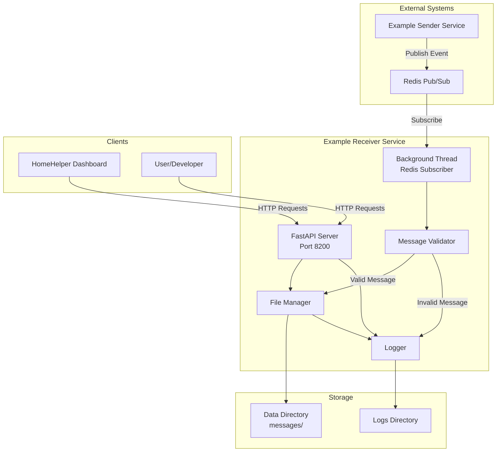
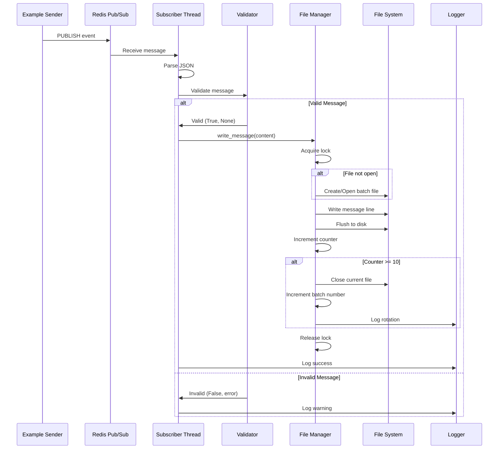
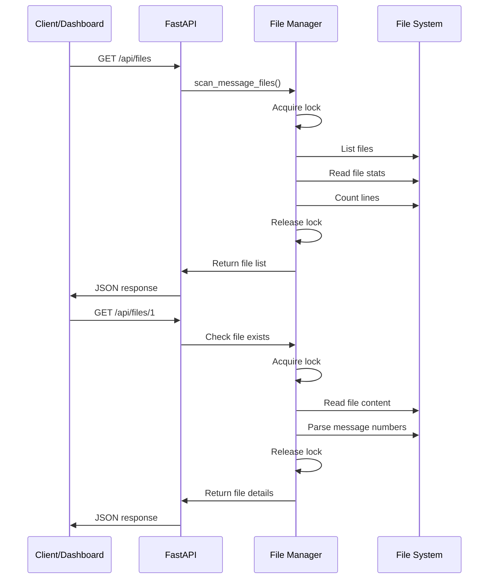
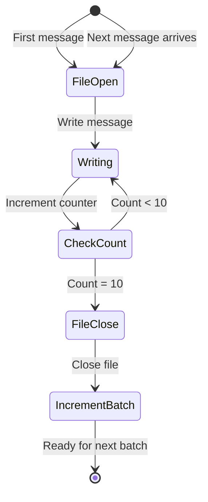
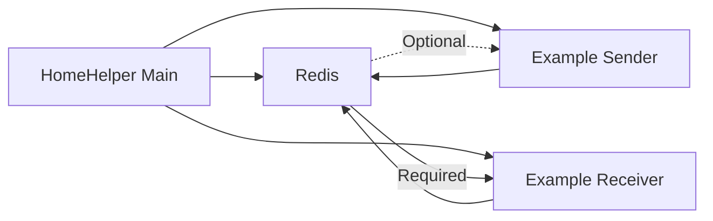

# Architecture - Example Receiver Service

## System Overview

The Example Receiver Service is a message consumer application that demonstrates the subscriber pattern in the HomeHelper ecosystem. It receives events from Redis, processes them, and persists data to rotating files.

## High-Level Architecture



## Component Architecture

### 1. FastAPI Server (Main Thread)

**Responsibilities:**
- Handle HTTP requests
- Expose REST API endpoints
- Serve health status
- Provide file browsing capabilities

**Endpoints:**
- `GET /health` - Service health and metrics
- `GET /ui` - List available resources
- `GET /api/files` - List all message files
- `GET /api/files/{id}` - Get specific file details

**Port:** Dynamically assigned by HomeHelper (default: 8200 for testing)

### 2. Redis Subscriber (Background Thread)

**Responsibilities:**
- Subscribe to Redis events
- Listen for messages continuously
- Parse JSON payloads
- Invoke message validator
- Handle connection failures

**Channel:** `homehelper:events:example.message.sent`

**Thread Type:** Daemon thread (non-blocking)

**Lifecycle:**
- Started on service initialization
- Runs continuously until shutdown signal
- Automatically reconnects on Redis failure

### 3. Message Validator

**Responsibilities:**
- Validate message structure
- Check required fields
- Verify data types
- Return validation results

**Validation Rules:**
```python
Required Fields:
- event_type: "example.message.sent"
- data.message_number: integer
- data.content: string
```

**Error Handling:**
- Invalid messages logged as warnings
- Service continues processing
- No crash on validation failure

### 4. File Manager

**Responsibilities:**
- Write messages to files
- Rotate files after 10 messages
- Manage batch numbering
- Scan files for metadata
- Handle concurrent access

**File Operations:**
- Create new batch files
- Append messages to current file
- Close completed files
- Resume from last batch on restart

**Thread Safety:**
- Uses `threading.Lock()` for all file operations
- Prevents race conditions between writer and readers

### 5. Logger

**Responsibilities:**
- Write operational logs
- Track message processing
- Log errors and warnings
- Provide debugging information

**Log Levels:**
- INFO: Normal operations
- WARNING: Invalid messages, non-critical issues
- ERROR: Critical failures

**Output:**
- File: `{logs_dir}/example_receiver/app_YYYYMMDD.log`
- Console: Real-time stdout

## Data Flow

### Message Reception Flow



### API Request Flow



## File Storage Architecture

### Directory Structure

```
{data_dir}/
└── example_receiver/
    └── messages/
        ├── messages_batch_0001.txt
        ├── messages_batch_0002.txt
        ├── messages_batch_0003.txt
        └── ...
```

### File Naming Convention

**Pattern:** `messages_batch_NNNN.txt`
- Zero-padded 4 digits
- Sequential numbering
- Supports up to 9999 batches

### File Content Format

```
[YYYY-MM-DD HH:MM:SS] Message #N: content
```

**Example:**
```
[2025-10-16 14:56:05] Message #1: Test message number 1
[2025-10-16 14:56:06] Message #2: Test message number 2
```

### File Rotation Logic



**Rotation Trigger:** After writing 10th message
**New File Creation:** When 11th message arrives

## State Management

### Global State Variables

```python
# Message counters
total_messages_received: int = 0
current_batch_number: int = 1
messages_in_current_batch: int = 0

# File handles
current_file: Optional[TextIO] = None

# Status tracking
last_message_time: Optional[datetime] = None
redis_connected: bool = False

# Thread synchronization
file_lock: threading.Lock
shutdown_event: threading.Event
```

### State Persistence

**On Startup:**
1. Scan existing files in data directory
2. Determine last batch number
3. Count messages in last file
4. Resume from correct batch number

**On Shutdown:**
1. Set shutdown event
2. Close current file
3. Stop subscriber thread
4. Exit gracefully

## Concurrency Model

### Threading Strategy

**Main Thread:**
- Runs FastAPI/Uvicorn server
- Handles HTTP requests
- Reads files for API responses

**Background Thread:**
- Subscribes to Redis events
- Processes messages
- Writes to files

### Synchronization

**Lock Protection:**
- File write operations
- File read operations (for current batch)
- File metadata scanning

**Lock-Free Operations:**
- Health status reads
- Counter reads (atomic in Python)

## Error Handling Strategy

### Redis Connection Failures

**Detection:**
- Connection test on startup
- Monitor connection status

**Handling:**
- Log error
- Update health status to "warning"
- Continue running (don't crash)
- Rely on Redis client auto-reconnect

### File Write Failures

**Detection:**
- Try-except around file operations

**Handling:**
- Log error
- Update health status to "error"
- Continue processing (best effort)

### Invalid Messages

**Detection:**
- Message validation function

**Handling:**
- Log warning with error details
- Skip message
- Continue processing next message

### API Errors

**Detection:**
- File not found
- Invalid file ID

**Handling:**
- Return proper HTTP status code (404)
- Return JSON error response
- Log error for debugging

## Performance Characteristics

### Throughput

**Expected Load:**
- 1 message every 30 seconds (from Example Sender)
- ~2,880 messages per day
- ~288 files per day

**Capacity:**
- Can handle much higher throughput
- Limited by disk I/O
- No artificial rate limiting

### Latency

**Message Processing:**
- Validation: < 1ms
- File write: < 10ms (with flush)
- Total: < 20ms per message

**API Response:**
- Health endpoint: < 5ms
- File list: < 50ms (depends on file count)
- Single file: < 100ms (depends on file size)

### Resource Usage

**Memory:**
- Minimal (< 50 MB)
- No message buffering
- Files read on-demand

**Disk:**
- ~100 bytes per message
- ~1 KB per file
- Grows unbounded (by design)

**CPU:**
- Minimal (< 1%)
- Event-driven processing
- No polling loops

## Security Considerations

### Data Protection

**File Permissions:**
- Files created with default user permissions
- No encryption (demo application)

**API Access:**
- No authentication (demo application)
- Intended for internal HomeHelper use

### Input Validation

**Message Validation:**
- Type checking on all fields
- No SQL injection risk (no database)
- No command injection risk (no shell execution)

**API Input:**
- File ID validated as integer
- Path traversal prevented (no user-supplied paths)

## Scalability Considerations

### Current Limitations

**Single Instance:**
- No horizontal scaling
- Single file writer
- No distributed locking

**File System:**
- Limited by disk space
- No file cleanup
- No compression

### Future Enhancements (Out of Scope)

**For Production:**
- Database instead of files
- Message buffering/queuing
- File retention policies
- Compression
- Distributed deployment
- Load balancing

## Deployment Architecture

### Local Development

```
Developer Machine
├── Redis (localhost:6379)
├── Example Sender (port 8100)
└── Example Receiver (port 8200)
```

### HomeHelper Integration

```
HomeHelper System
├── Main App (manages services)
├── Redis (shared message bus)
├── Example Sender Service
│   ├── Port: Assigned by main app
│   ├── Data: /opt/homehelper/data/example_sender
│   └── Logs: /opt/homehelper/logs/example_sender
└── Example Receiver Service
    ├── Port: Assigned by main app
    ├── Data: /opt/homehelper/data/example_receiver
    └── Logs: /opt/homehelper/logs/example_receiver
```

### Service Dependencies



## Monitoring and Observability

### Health Monitoring

**Health Endpoint:**
- Service status
- Message counters
- File counts
- Redis connection status
- Last message timestamp

**Health States:**
- `good`: Normal operation
- `warning`: Redis issues or no recent messages
- `error`: Critical failure

### Logging

**Log Locations:**
- File: `{logs_dir}/example_receiver/app_YYYYMMDD.log`
- Console: stdout

**Log Contents:**
- Service startup/shutdown
- Message reception
- File rotation
- Errors and warnings
- API requests (via Uvicorn)

### Metrics

**Available Metrics:**
- Total messages received
- Current batch number
- Messages in current batch
- Total files created
- Last message timestamp
- Redis connection status

## Design Decisions

### Why Files Instead of Database?

**Rationale:**
- Simplicity for demo application
- Easy to inspect and debug
- No external dependencies
- Demonstrates data persistence pattern

### Why 10 Messages Per File?

**Rationale:**
- Small enough to demonstrate rotation quickly
- Large enough to be meaningful
- Easy to verify in testing
- Hardcoded for simplicity (not configurable)

### Why Background Thread Instead of Async?

**Rationale:**
- Redis client uses blocking `listen()`
- Simpler than async/await for this use case
- FastAPI already handles async for API
- Clear separation of concerns

### Why No Message Buffering?

**Rationale:**
- Demonstrates pub/sub fire-and-forget nature
- Keeps demo simple
- Real apps should use Redis Streams for reliability
- Acceptable for demo purposes

## Conclusion

The Example Receiver Service architecture demonstrates a clean, maintainable approach to building HomeHelper service apps. It balances simplicity with functionality, making it an excellent reference implementation for developers.
