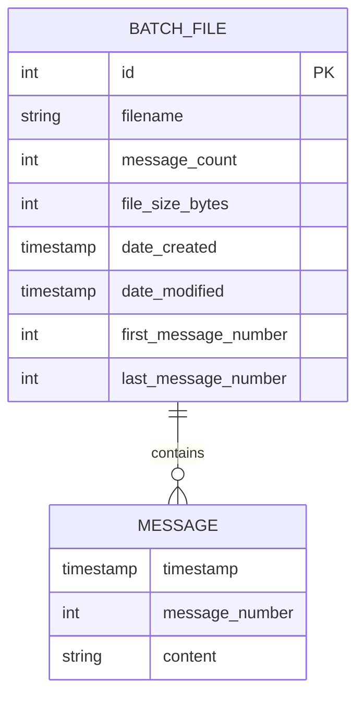

# Database Schema - Example Receiver Service

## Overview

The Example Receiver Service does **not use a traditional database**. Instead, it uses a **file-based storage system** for persisting message data. This document describes the data model and file structure used by the service.

## Data Storage Strategy

### File-Based Storage

**Rationale:**
- Simplicity for demo application
- Easy to inspect and debug
- No external database dependencies
- Demonstrates data persistence pattern
- Human-readable format

**Trade-offs:**
- No indexing or querying capabilities
- Limited scalability
- No ACID guarantees
- Manual file management required

## Data Model

### Message Entity

Represents a single message received from Redis.

**Fields:**
| Field | Type | Description | Example |
|-------|------|-------------|---------|
| timestamp | datetime | When message was received | 2025-10-16 14:56:05 |
| message_number | integer | Sequential message number from sender | 42 |
| content | string | Message content | "Test message 42" |

**Storage Format:**
```
[{timestamp}] Message #{message_number}: {content}
```

**Example:**
```
[2025-10-16 14:56:05] Message #42: this is Message N° 42 being posted into Redis
```

### File Batch Entity

Represents a batch file containing multiple messages.

**Metadata:**
| Field | Type | Description | Source |
|-------|------|-------------|--------|
| id | integer | Batch number (1, 2, 3, ...) | Filename |
| filename | string | File name | File system |
| message_count | integer | Number of messages in file | Line count |
| file_size_bytes | integer | File size in bytes | File stats |
| date_created | timestamp | File creation time | File stats |
| date_modified | timestamp | Last modification time | File stats |
| first_message_number | integer | First message number in file | Parsed from content |
| last_message_number | integer | Last message number in file | Parsed from content |

**Constraints:**
- Maximum 10 messages per file (except last file)
- Sequential batch numbering
- Immutable once complete (10 messages)

## File Structure

### Directory Layout

```
{data_dir}/
└── example_receiver/
    └── messages/
        ├── messages_batch_0001.txt
        ├── messages_batch_0002.txt
        ├── messages_batch_0003.txt
        ├── messages_batch_0004.txt
        └── ...
```

### File Naming Convention

**Pattern:** `messages_batch_{batch_number:04d}.txt`

**Examples:**
- `messages_batch_0001.txt` - Batch 1
- `messages_batch_0002.txt` - Batch 2
- `messages_batch_0099.txt` - Batch 99
- `messages_batch_9999.txt` - Batch 9999
- `messages_batch_10000.txt` - Batch 10000 (padding breaks but still works)

**Batch Number Range:**
- Minimum: 1
- Maximum: Unbounded (padding breaks after 9999)
- Zero-padded to 4 digits

### File Content Schema

**Format:** Plain text, one message per line

**Line Format:**
```
[YYYY-MM-DD HH:MM:SS] Message #{number}: {content}\n
```

**Example File Content:**
```
[2025-10-16 14:56:05] Message #1: Test message number 1
[2025-10-16 14:56:06] Message #2: Test message number 2
[2025-10-16 14:56:07] Message #3: Test message number 3
[2025-10-16 14:56:08] Message #4: Test message number 4
[2025-10-16 14:56:09] Message #5: Test message number 5
[2025-10-16 14:56:10] Message #6: Test message number 6
[2025-10-16 14:56:11] Message #7: Test message number 7
[2025-10-16 14:56:12] Message #8: Test message number 8
[2025-10-16 14:56:13] Message #9: Test message number 9
[2025-10-16 14:56:14] Message #10: Test message number 10
```

## Data Relationships

### Conceptual Entity Relationship



**Relationship:**
- One batch file contains 0-10 messages
- Messages are ordered by timestamp within a file
- No foreign keys (file-based storage)

## Data Operations

### Create (Write)

**Operation:** Write new message to file

**Process:**
1. Acquire file lock
2. Open current batch file (or create if needed)
3. Format message line
4. Append to file
5. Flush to disk
6. Increment message counter
7. Check if rotation needed (counter >= 10)
8. If rotation: close file, increment batch number
9. Release file lock

**Concurrency:** Protected by `threading.Lock()`

**Atomicity:** Each write is flushed immediately

### Read (Query)

**Operation 1:** List all batch files

**Process:**
1. Scan messages directory
2. For each file matching pattern:
   - Parse batch number from filename
   - Get file statistics
   - Count lines (messages)
   - Build metadata object
3. Sort by batch number
4. Return list

**Operation 2:** Read single batch file

**Process:**
1. Validate batch ID
2. Construct filename
3. Check file exists
4. Acquire file lock (if current batch)
5. Read file content
6. Parse first/last message numbers
7. Release lock
8. Return file details with content

**Concurrency:** Lock only needed for current batch file

### Update

**Not Supported:** Files are append-only and immutable once complete

### Delete

**Not Supported:** No automatic deletion (by design)

**Manual Deletion:** User can delete old files if needed

## Data Integrity

### Write Integrity

**Flush Strategy:**
- Every write is followed by `flush()`
- Ensures data written to disk immediately
- Prevents data loss on crash

**Partial Writes:**
- If service crashes mid-write, line may be incomplete
- Acceptable for demo application
- Real apps should use write-ahead logging

### File Integrity

**Corruption Prevention:**
- Simple text format (easy to recover)
- No complex data structures
- Each line is independent

**Corruption Detection:**
- No checksums (demo application)
- Manual inspection possible

### Concurrency Control

**Locking Strategy:**
- `threading.Lock()` for all file operations
- Prevents race conditions
- Ensures consistent reads/writes

**Deadlock Prevention:**
- Single lock for all file operations
- Lock acquisition order is consistent
- Lock held for minimal time

## Data Growth and Retention

### Growth Rate

**Expected:**
- 1 message every 30 seconds
- 2,880 messages per day
- 288 files per day
- ~288 KB per day (at ~100 bytes/message)

**Annual:**
- ~1,051,200 messages
- ~105,120 files
- ~105 MB

### Retention Policy

**Current:** No automatic retention (unbounded growth)

**Implications:**
- Disk space will fill over time
- Manual cleanup required
- Acceptable for demo application

**Future Considerations (Out of Scope):**
- Delete files older than N days
- Compress old files
- Archive to external storage
- Implement max file count

## Data Migration

### Schema Changes

**Not Applicable:** Plain text format is schema-less

**Adding Fields:**
- Would require new file format
- Could use JSON lines instead
- Out of scope for demo

### Data Export

**Current Format:** Already human-readable text

**Export Options:**
- Copy files directly
- Parse and convert to JSON
- Import into database

**Example Export to JSON:**
```python
import json

def export_to_json(batch_file):
    messages = []
    with open(batch_file, 'r') as f:
        for line in f:
            # Parse: [timestamp] Message #N: content
            timestamp = line[1:20]
            msg_num = int(line.split('#')[1].split(':')[0])
            content = line.split(': ', 1)[1].strip()
            
            messages.append({
                'timestamp': timestamp,
                'message_number': msg_num,
                'content': content
            })
    
    return json.dumps(messages, indent=2)
```

## Backup and Recovery

### Backup Strategy

**File-Based Backup:**
- Copy entire `messages/` directory
- Use rsync, tar, or file sync tools
- Incremental backups possible

**Example Backup Command:**
```bash
# Backup to archive
tar -czf backup_$(date +%Y%m%d).tar.gz test_data/example_receiver/messages/

# Sync to remote
rsync -av test_data/example_receiver/messages/ backup_server:/backups/
```

### Recovery Strategy

**Full Recovery:**
1. Stop service
2. Restore `messages/` directory
3. Start service
4. Service resumes from last batch

**Partial Recovery:**
- Individual files can be restored
- Service will continue with existing batch numbering

### Disaster Recovery

**Data Loss Scenarios:**

1. **Disk Failure:**
   - Restore from backup
   - Messages during downtime are lost (no buffering)

2. **File Corruption:**
   - Delete corrupted file
   - Service continues with next batch
   - Lost messages cannot be recovered

3. **Accidental Deletion:**
   - Restore from backup
   - Service resumes from last available batch

## Performance Considerations

### Read Performance

**File List:**
- O(n) where n = number of files
- Requires scanning directory
- Requires reading each file to count lines
- Can be slow with many files (1000+)

**Single File:**
- O(1) file access
- O(m) where m = file size
- Fast for small files (< 1 KB)

### Write Performance

**Append:**
- O(1) for each write
- Flush adds ~5-10ms latency
- Acceptable for low-throughput demo

**Rotation:**
- O(1) close and create
- No data copying required

### Optimization Opportunities (Out of Scope)

**Caching:**
- Cache file metadata in memory
- Update on write
- Avoid scanning on every API call

**Indexing:**
- Maintain index file with metadata
- Update on rotation
- Fast lookups without scanning

**Database Migration:**
- Use SQLite for better query performance
- Maintain same API interface
- Better for production use

## Comparison with Traditional Database

### File-Based Storage (Current)

**Pros:**
- ✅ Simple implementation
- ✅ No external dependencies
- ✅ Human-readable format
- ✅ Easy to debug
- ✅ Easy to backup

**Cons:**
- ❌ No indexing
- ❌ No querying
- ❌ Limited scalability
- ❌ Manual management required
- ❌ No ACID guarantees

### SQLite Alternative (Not Implemented)

**Schema:**
```sql
CREATE TABLE batches (
    id INTEGER PRIMARY KEY,
    filename TEXT NOT NULL,
    message_count INTEGER DEFAULT 0,
    date_created INTEGER NOT NULL,
    date_modified INTEGER NOT NULL
);

CREATE TABLE messages (
    id INTEGER PRIMARY KEY AUTOINCREMENT,
    batch_id INTEGER NOT NULL,
    message_number INTEGER NOT NULL,
    content TEXT NOT NULL,
    timestamp INTEGER NOT NULL,
    FOREIGN KEY (batch_id) REFERENCES batches(id)
);

CREATE INDEX idx_batch_id ON messages(batch_id);
CREATE INDEX idx_message_number ON messages(message_number);
```

**Pros:**
- ✅ Fast queries
- ✅ Indexing
- ✅ ACID guarantees
- ✅ Better scalability

**Cons:**
- ❌ More complex
- ❌ External dependency
- ❌ Binary format (harder to debug)
- ❌ Overkill for demo

## Data Access Patterns

### Write Pattern

**Frequency:** ~1 write per 30 seconds  
**Type:** Sequential append  
**Concurrency:** Single writer (background thread)  
**Consistency:** Immediate flush

### Read Pattern

**Frequency:** On-demand (API requests)  
**Type:** Full file scan or single file read  
**Concurrency:** Multiple readers possible  
**Caching:** None (read from disk each time)

### Common Queries

1. **List all files:**
   - Scan directory
   - Read file stats
   - Count lines in each file

2. **Get specific file:**
   - Direct file access by ID
   - Read full content
   - Parse message numbers

3. **Get health metrics:**
   - Count files in directory
   - Read counters from memory

## Conclusion

The file-based storage system provides a simple, effective solution for the Example Receiver Service demo application. While it lacks the features of a traditional database, it successfully demonstrates data persistence patterns and is appropriate for the service's limited scope and throughput requirements.

For production applications with higher throughput, complex queries, or strict consistency requirements, a traditional database (SQLite, PostgreSQL, etc.) would be more appropriate.
